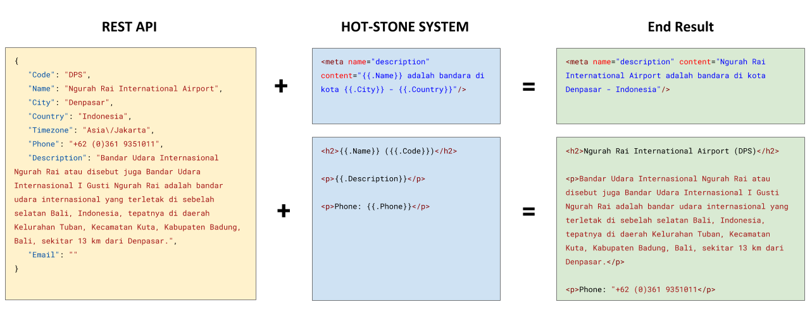

# HotStone SEO

Tag Management System with Server-Side-Rendering and Data-Sourcing
{: .fs-5}

---

## Features

1. Slick UI/UX
2. Authentication/authorization
3. External Data Sourcing
4. Server-side Rendering (SSR) client
5. High Performance 
6. Bulk management using url pattern and templating language

## External Data Sourcing


{: .prop}

Data Provider (API): 
```json
{
   "code": "DPS",
   "name": "Ngurah Rai International Airport",
   "city": "Denpasar",
   "country": "Indonesia",
   "timezone": "Asia\/Jakarta",
   "phone": "+62 (0)361 9351011",
   "description": "Bandar Udara Internasional Ngurah Rai atau disebut juga Bandar Udara Internasional I Gusti Ngurah Rai adalah bandar udara internasional yang terletak di sebelah selatan Bali, Indonesia, tepatnya di daerah Kelurahan Tuban, Kecamatan Kuta, Kabupaten Badung, Bali, sekitar 13 km dari Denpasar.",
   "email": ""
}
```


HotStone Meta Tag Template:




Meta Tag result:
```html
<meta name="description" content="Ngurah Rai International Airport adalah bandara di kota Denpasar - Indonesia"/>
```

HotStone Article Template:

```html
<h2>{{.Name}} ({{.Code}})</h2>

<p>{{.Description}}</p>

<p>Phone: {{.Phone}}</p>
```


Artical result:
```html
<h2>Ngurah Rai International Airport (DPS)</h2>

<p>Bandar Udara Internasional Ngurah Rai atau disebut juga Bandar Udara Internasional I Gusti Ngurah Rai adalah bandar udara internasional yang  terletak di sebelah selatan Bali, Indonesia, tepatnya di daerah Kelurahan Tuban, Kecamatan Kuta, Kabupaten Badung, Bali, sekitar 13 km dari Denpasar.</p>

<p>Phone: "+62 (0)361 9351011</p>
```


<br />


<table class="mt-5">
    <thead>
        <th>Hotstone Template</th>
        <th>Result</th>
    </thead>
    <tr>
        <td style="width:50%;" valign="top"><div class="language-html highlighter-rouge"><div class="highlight"><pre class="highlight"><code><span class="nt">&lt;meta</span> <span class="na">name=</span><span class="s">"description"</span> <span class="na">content=</span><span class="s">"{{.Name}} adalah bandara di kota {{.City}} - {{.Country}}"</span><span class="nt">/&gt;</span>
</code></pre></div></div></td>
        <td  style="width:50%;" valign="top"><div class="language-html highlighter-rouge"><div class="highlight"><pre class="highlight"><code><span class="nt">&lt;meta</span> <span class="na">name=</span><span class="s">"description"</span> <span class="na">content=</span><span class="s">"Ngurah Rai International Airport adalah bandara di kota Denpasar - Indonesia"</span><span class="nt">/&gt;</span>
</code></pre></div></div></td>
    </tr>
    <tr>
        <td style="width:50%;" valign="top"><div class="language-html highlighter-rouge"><div class="highlight"><pre class="highlight"><code><span class="nt">&lt;h2&gt;</span>{{.Name}} ({{.Code}})<span class="nt">&lt;/h2&gt;</span>

<span class="nt">&lt;p&gt;</span>{{.Description}}<span class="nt">&lt;/p&gt;</span>

<span class="nt">&lt;p&gt;</span>Phone: {{.Phone}}<span class="nt">&lt;/p&gt;</span>
</code></pre></div></div></td>
        <td style="width:50%;" valign="top"><div class="language-html highlighter-rouge"><div class="highlight"><pre class="highlight"><code><span class="nt">&lt;h2&gt;</span>Ngurah Rai International Airport (DPS)<span class="nt">&lt;/h2&gt;</span>

<span class="nt">&lt;p&gt;</span>Bandar Udara Internasional Ngurah Rai atau disebut juga Bandar Udara Internasional I Gusti Ngurah Rai adalah bandar udara internasional yang  terletak di sebelah selatan Bali, Indonesia, tepatnya di daerah Kelurahan Tuban, Kecamatan Kuta, Kabupaten Badung, Bali, sekitar 13 km dari Denpasar.<span class="nt">&lt;/p&gt;</span>

<span class="nt">&lt;p&gt;</span>Phone: "+62 (0)361 9351011<span class="nt">&lt;/p&gt;</span>
</code></pre></div></div></td>
    </tr>
</table>



---

## Project Status


*WIP – Initial development is in progress, but there has not yet been a stable, usable release suitable for the public.*

---