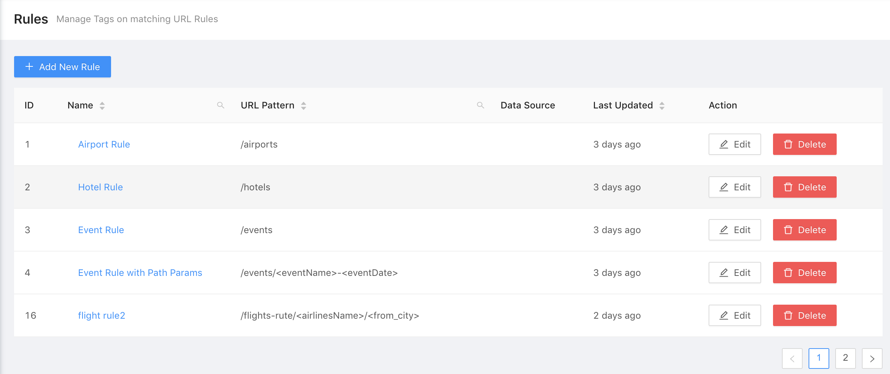
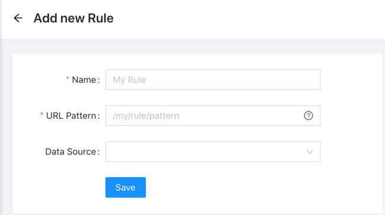
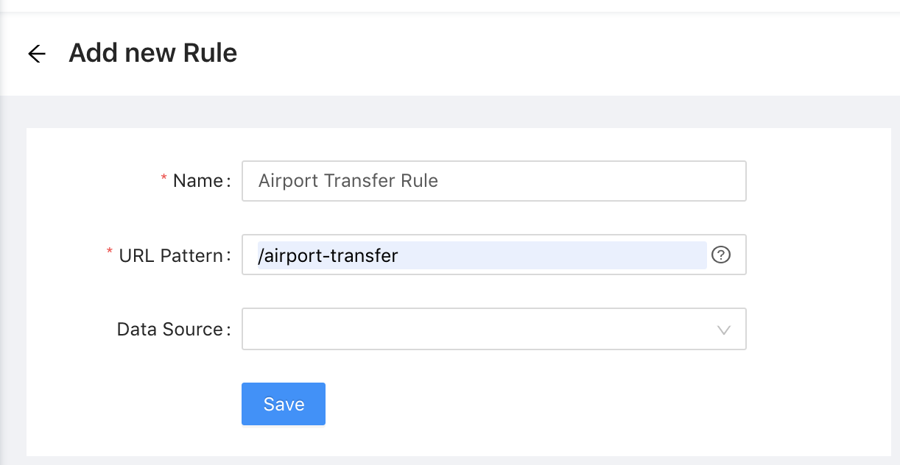
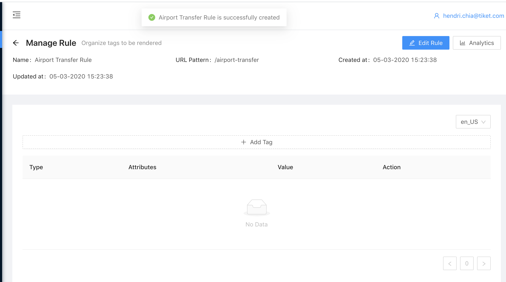

# Creating Rule

{: .prop}

Steps to create a new rule:
{: .prop}

1. Click Button '<b><i>Add New Rule</i></b>' which is located above table

    * Field `Name` and `URL Pattern` are mandatory fields 
    * Press <- to return to Rule List

2. Please fill in all mandatory fields

3. Press button '<b><i>Save</i></b>' to save new data

4. After press Save button, will be redirect to Tag List

# Editing Rule

