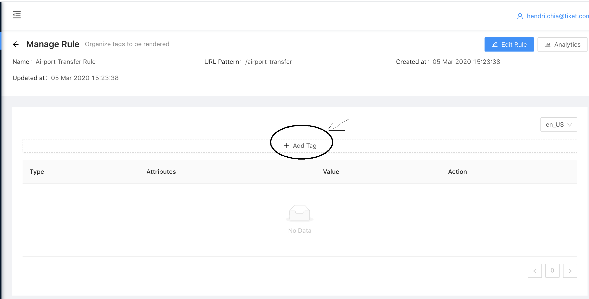
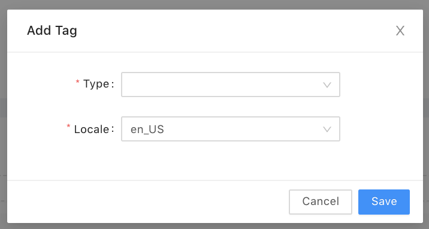
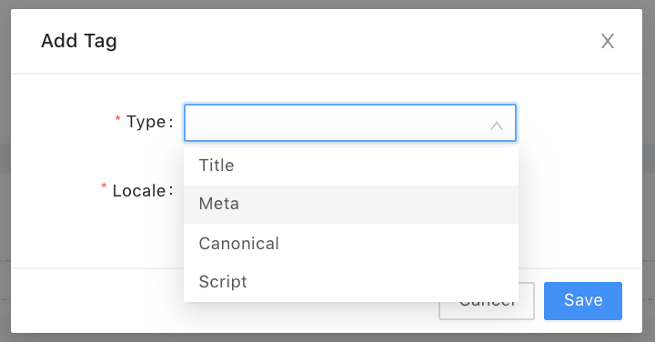
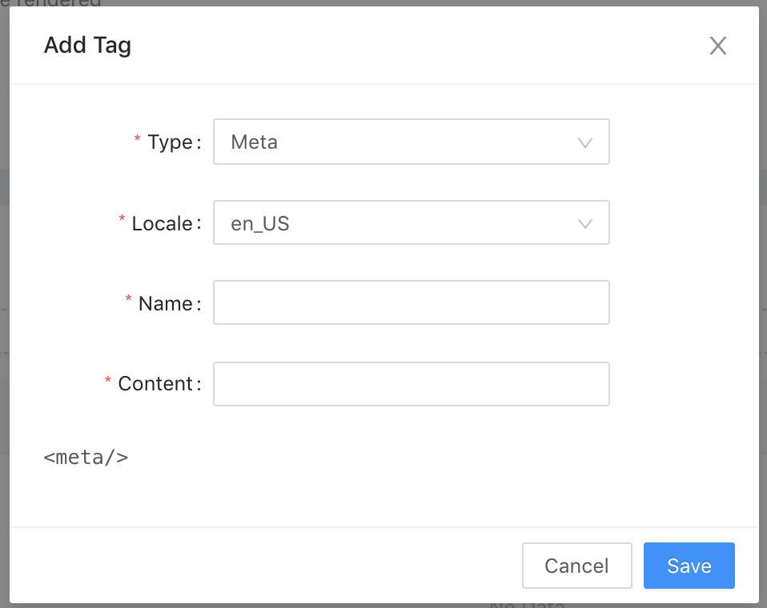

# Creating Meta Tag

{: .prop}

Steps to create a new <i>Meta Tag</i>:
{: .prop}

1. Click '<b><i>Add Tag</i></b>' button which is located above table
    

2. Choose '<b><i>Meta</i></b>'
    

    

3. Please fill in <i>Name</i> & <i>Content</i> field

4. Press '<b><i>Save</i></b>' button to save new <i>Meta Tag</i>

# Creating Title Tag

# Creating Canonical Tag

# Creating Script Tag

# Editing Meta Tag

# Editing Title Tag

# Editing Canonical Tag

# Editing Script Tag